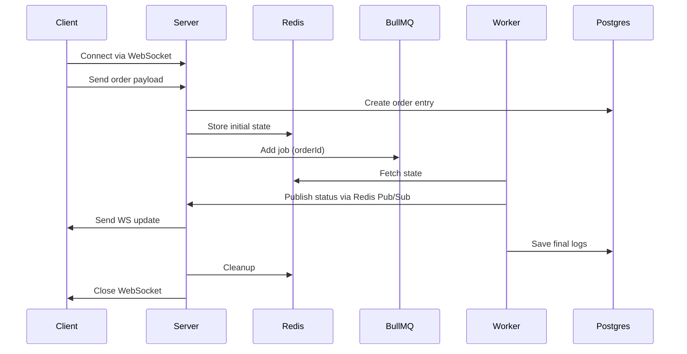

#  Order Execution Engine – DEX Router + WebSocket Updates

This project implements a **Market Order Execution Engine** with **DEX routing**, **BullMQ queueing**, **Redis pub/sub**, and **WebSocket live updates**. It is designed to demonstrate a robust, scalable backend architecture for real-time order processing.


We chose **Market Orders** as the primary focus because they represent the core execution flow nreal-time status updates, routing logic, retries and queue orchestration without the added complexity of limit order books or on-chain monitoring. This allows for a cleaner demonstration of backend reliability and architecture.

---

##  High-Level Architecture

### Major Components

*   **Fastify API + WebSocket server**: Handles client connections and real-time updates.
*   **Redis**:
    *   **Hash storage**: For active order state and metadata.
    *   **Pub/Sub**: For broadcasting live updates to clients.
*   **PostgreSQL**:
    *   **Persistent storage**: For order records and detailed execution logs.
*   **BullMQ (Redis-backed)**:
    *   **Order Queue**: Handles 10 concurrent jobs with rate limiting (100 orders/min).
    *   **Retries**: Exponential backoff with max 3 attempts.
*   **Mock DEX Engine**:
    *   Simulates Raydium & Meteora quotes.
    *   Handles slippage checks.
    *   Simulates realistic network delays (2–3s).
    *   **Randomized Failure Injection**: For testing error handling and retries.

---

 **Public URl** : https://order-execution-engine-okos.onrender.com

 **endpoint** : https://order-execution-engine-okos.onrender.com/api/orders/execute
 
 **method** : GET
 
 **Expected payload (First message after successful ws connection)** :   
 
    
    "tokenIn": "SOL",
    
    "tokenOut": "USDC",
    
    "amount": "1",
    
    "orderType": "MARKET"


---

##  Design Decision: WebSocket Flow
Assignment originally expected:
  POST /orders/execute → returns orderId  -------  Frontend connects via WebSocket  ------- Engine starts processing

 **Problems with that approach:**
**Race Condition:**
If the worker starts immediately, client may not have WebSocket established → missed events or inconsistent timings.

**Two network calls needed**
POST → then GET (WebSocket) — unnecessary roundtrip.

**Frontend complexity increases**

###  Improved Approach
1.  **Direct WebSocket Connection**: Client connects via `GET /api/orders/execute`.
2.  **Payload via WS**: Client sends the order payload directly over the established WebSocket.
3.  **Instant Creation**: Server creates the order and adds it to the queue immediately.
4.  **Live Streaming**: Updates are streamed from the very first state change.
5.  **Auto-Cleanup**: Connection closes automatically upon `confirmed` or `failed` status.

### Why WebSocket-first?
**Prevents race conditions (worker may start before WS is connected)**

**Ensures no missed status updates**

**Reduces unnecessary API calls**

**Simpler frontend**

**Ensures WS is guaranteed before processing begins**

**Cleaner event-driven architecture**

## Order Execution Flow : 



## Extending the Engine to Support Limit & Sniper Orders 

Although this project implements Market Orders, the architecture is intentionally designed so that Limit and Sniper orders can be added with minimal changes.
All order types ultimately flow through the same execution engine, but they differ in when they are allowed to execute.

### Limit Orders flow :

A limit order should only execute when market price reaches the user-defined target.

To support limit orders, the system can be extended using the following components:

**1️. Store Limit Orders Separately (Redis) :**
```
Instead of immediately queueing workload like market orders, limit orders are stored in Redis with fields like:

**orderId, targetPrice, tokenIn / tokenOut, amount, status = WAITING_FOR_PRICE**

This prevents workers from being blocked while waiting for the market to reach the limit price.
```

**2️. Add a Price Monitoring Service :**
```
A lightweight service subscribes to live or periodic pricing updates.
For each update, it:

Fetches open limit orders

Checks if targetPrice is reached

If yes, pushes the order into the same BullMQ queue used by market orders

Marks status accordingly (TRIGGERED → PENDING → ROUTING ... )

This isolates condition-checking from order execution and avoids worker starvation.
```

**3️ Worker Processes It Like a Market Order**

### How Sniper Orders Can Be Supported


**A sniper order is similar to a limit order but uses more dynamic & aggressive triggers such as:**
```
Instant execution when price moves within X%

Execute when liquidity threshold is reached

Execute when first pool initializes (launch sniping)
```
### Sniper Order Flow :

**1 . Sniper order is stored in Redis with its trigger rules**

**2.Sniper Monitor Service (same service or extended variant) continuously checks:**
```
Price velocity

Liquidity depth

Launch detection
```

**3.When sniper conditions are satisfied → push to order-queue**

**4.Worker executes exactly as a market order**

## 🛠 Setup & Deployment

### Prerequisites
*   Node.js v20+
*   Docker & Docker Compose (optional)
*   Redis instance
*   PostgreSQL instance

### Environment Variables
Create a `.env` file:
```env
PORT=3000
NODE_ENV=development
DATABASE_NAME=your_db_name
DATABASE_USERNAME=your_username
DATABASE_PASSWORD=your_password
DATABASE_HOST=your_db_host
DATABASE_PORT=5432
DATABASE_SSL=true
DATABASE_SSL_REJECT_UNAUTHORIZED=false
REDIS_URL=redis://host:6379
DATABASE_SSL_CA=<base64 encoded CA certificate> (optional)
```

### Running Locally
1.  **Install Dependencies**:
    ```bash
    npm install
    ```
2.  **Start Development Server**:
    ```bash
    npm run dev
    ```
3.  **Run Simulation Script**:
    To verify the flow with concurrent orders:
    ```bash
    npx ts-node scripts/test-flow.ts
    ```

### Running Tests
```cmd
npm run test
```

### Docker
```cmd
docker-compose build
docker-compose up
docker-compose down


Once the Docker containers are built, the application automatically connects to your deployed PostgreSQL and Redis instances using the environment variables provided in your .env file.
```
---

##  Testing Features

*   **Unit Tests**: Comprehensive Jest tests for routing, validation, and service logic.
*   **Simulation**: `scripts/test-flow.ts` simulates multiple concurrent orders to verify queue behavior and WebSocket broadcasting.
*   **Failure Injection**: The `DexEngine` has a ~15% chance to simulate a random on-chain failure, triggering the retry mechanism and allowing you to verify error handling.

---

##  Documentation

For a deep dive into the system design, data models, and sequence flows, please see [docs/ARCHITECTURE.md](docs/ARCHITECTURE.md).


